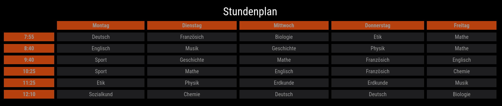

# Timetable

This is a module for Magic Mirror which can display timetables for example in schools.



## Installation

1. Navigate to the `MagicMirror/modules` directory and execute the following command

   ```sh
   git clone https://github.com/Phaneron404/MMM-Timetable.git
   ```

2. Change into the MMM-Timetable module folder and install runtime dependencies with

   ```sh
   cd MMM-Timetable
   npm install --only=production
   ```

3. Add the module configuration into the `MagicMirror/config/config.js` file (sample configuration):

```javascript
{
    module: "MMM-Timetable",
    position: "lower_third",
    config: {
        header: "Stundenplan",
        timeTable: [
            { cells: [{ texts: [] }, { texts: ["Montag"] }, { texts: ["Dienstag"] }] },
            { cells: [{ texts: ["7:55"] }, { texts: ["Deutsch"] }, { texts: ["Französich"] }] },
            { cells: [{ texts: ["8:40"] }, { texts: ["Englisch"] }, { texts: ["Musik"] }] },
            { cells: [{ texts: ["9:40"] }, { texts: ["Sport"] }, { texts: ["Geschichte"] }] },
            { cells: [{ texts: ["10:25"] }, { texts: ["Sport"] }, { texts: ["Mathe"] }] },
            { cells: [{ texts: ["11:25"] }, { texts: ["Etik"] }, { texts: ["Physik"] }] },
            { cells: [{ texts: ["12:10"] }, { texts: ["Sozialkund"] }, { texts: ["Chemie"] }] },
            ]
    }
},
```

### Configuration

NOTE: Further explanations coming soon.

#### Config

| Attribute      | Description                                     |
| -------------- | ----------------------------------------------- |
| srcCSV         | The source of a CSV file.                       |
| timeTable      | A List of Rows                                  |
| header         | A string for the table header.                  |
| borderWidth    | Number indicating the border width.             |
| borderColor    | String indicating the border color.             |
| emptyCellColor | String indicating the color of empty cells.     |
| cellColor      | String indicating the color of non-empty cells. |
| titleCellColor | String indicating the color of title cells.     |
| titleRow       | Array of numbers specifying title rows.         |
| titleColumn    | Array of numbers specifying title columns.      |
| pagination     | Object containing pagination configuration.     |

#### Row

| Attribute | Description               |
| --------- | ------------------------- |
| cells     | An array of Cell objects. |

#### Cell

| Attribute | Description             |
| --------- | ----------------------- |
| texts     | An array of strings.    |
| id        | Optional: A numeric ID. |

#### Pagination

| Attribute | Description                                           |
| --------- | ----------------------------------------------------- |
| mode      | A string representing the mode.                       |
| keepFirst | A boolean indicating whether to keep the first value. |
| duration  | A number representing the duration.                   |
| maxValues | A number representing the maximum allowed values.     |

## Geting Started Development

### Magic Mirror

Install Magic Mirror. [MagicMirror Documentation](https://docs.magicmirror.builders/getting-started/installation.html)

1. Check out the Magic Mirror Repo.

   ```sh
   git clone https://github.com/MagicMirrorOrg/MagicMirror.git
   ```

2. Enter the repository.

   ```sh
   cd MagicMirror/
   ```

3. Install the application.

   ```sh
   npm run install-mm
   ```

4. Make a copy of the config sample file

   ```sh
   cp config/config.js.sample config/config.js
   ```

5. Run Magic Mirror

   ```sh
   npm run server
   ```

6. Open Magic Mirror in the Browser

   ```url
   http://localhost:8080/
   ```

### MMM-Timetable

1. Change directory to modules.

   ```sh
   cd modules
   ```

2. Check out the MMM-Timetable Repo.

   ```sh
   git clone https://github.com/Phaneron404/MMM-Timetable.git
   ```

3. Change directory to MMM-Timetable.

   ```sh
   cd MMM-Timetable
   ```

4. Install the node modules.

   ```sh
   npm install
   ```

5. Build Javascript from Typescript.

   ```sh
   npm run build
   ```

## Further Help

[Module Configuration](https://docs.magicmirror.builders/modules/configuration.html#example)
